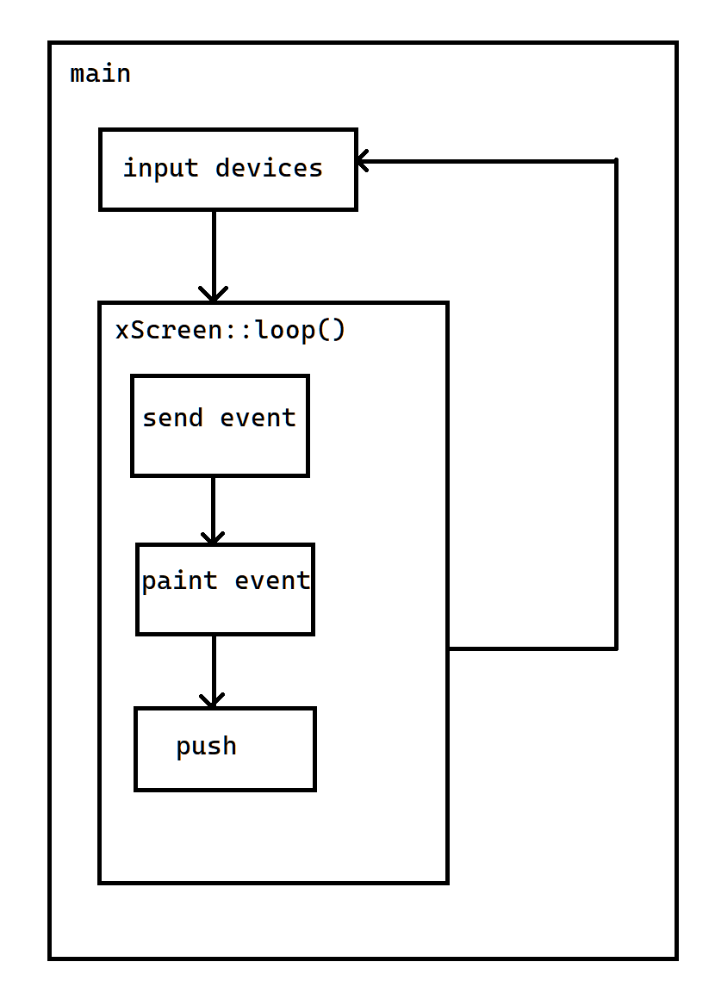

<h1 align="center">xcUI - 跨平台的UI库</h1>
<div align="center">
<h2>⚠⚠本项目使用GNU3.0许可证，请遵守许可内容，否则后果自负⚠⚠</h2>
[English](./README.en.md) | 简体中文
</div>

## ✨概述
这是一个跨平台的UI库，使用 __纯C++__ 编写， __没有使用std库__ 。你只需要提供输出像素的函数[void(uint64_t, uint64_t, Color)]和输入设备的函数[const char*()]就可以在设备上使用了。
### xcUI的实现逻辑

xcUI主要结构如上图：在一个循环中，不停地调用获取输入设备信息的函数，再对接受到的数据进行处理，使这些数据变成易于xuiObject使用的xEvent对象，然后向最底层的xuiObject对象发送paint事件，最后将已经接收到所有绘图信息的屏幕推送到输出设备上。

## 📖使用教程
### 示例
#### 画一条直线(./example/DrawALine)
```c++
//文件: ./main.cpp
//在Visual Studio 2022 + easyx上编译

#include "../../include/Device/xScreen.h"
#include "../../include/Device/xPainter.h"
#include <graphics.h>
using namespace xc;

xScreen *screen;

void DrawPixel(uint64_t x, uint64_t y, Colour c) {
    PutPixel(x, y, RGB(c.r, c.g, c.b));
}

int main() {
    initgraph(640, 480);
    screen = new xScreen(DrawPixel, Std::Rectangle(640, 480));
    xPainter* painter = new xPainter(screen, Std::Area(640, 480));
    painter->DrawLine(Std::Coordinate(0, 0), Std::Coordinate(100, 100));
    screen->Push();
    while (1);
    closegraph();
} 
```
---
#### 桌面闹钟(./example/alarm)(Todo)
```c++
#include "../../include/Object/xuiObject.h"
```
## 📰更新日志
### 2023.08.09 - 周三

- 对于xBaseObject的更改 
    - 合并了xBaseObject和xuiObject
    - 废弃xBaseObject
- 实现了xPainter的基本绘图函数
- 添加了xuiObject中的GetReal系列函数，用于更新绘图区域
- 添加了xuiObject.h中的注释
- 添加了xuiObject::SetChangeChildrensAttributeOnSetAttribute()函数，用于设置是否在对象属性被设置或更新时更改子对象的相同属性
- 添加了xuiObject::GetFocus()和xuiObject::LostFocus，并添加对应的二次处理函数:xuiObject::onGetFocusEvent()和xuiObject::onLostFocusEvent()
